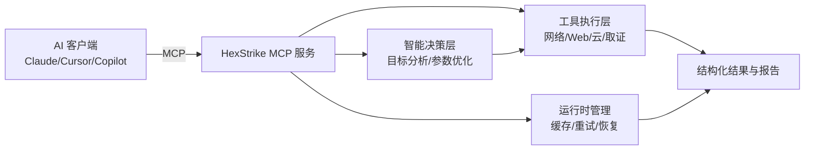

<div align="center">


# HexStrike AI MCP Agents v6.0（中文文档）

### 基于 AI 的 MCP 网络安全自动化平台

[](https://www.python.org/)
[](LICENSE)
[](https://github.com/0x4m4/hexstrike-ai)
[](https://github.com/0x4m4/hexstrike-ai)
[](https://github.com/0x4m4/hexstrike-ai/releases)
[](https://github.com/0x4m4/hexstrike-ai)
[](https://github.com/0x4m4/hexstrike-ai)
[](https://github.com/0x4m4/hexstrike-ai)

**面向渗透测试、漏洞研究与自动化攻防流程的 AI 驱动 MCP 框架（150+ 安全工具、12+ 自主智能代理）**

[安装部署](#安装) • [Docker 部署](#docker-容器部署kali-基础镜像) • [功能概览](#功能概览) • [工具目录](#工具目录) • [API 参考](#api-参考) • [排障](#故障排查)

</div>

---

## 说明

本文件为项目主 README，覆盖安装、集成、能力、API、排障与安全使用说明。

---


---

## 架构总览

HexStrike AI MCP v6.0 采用多代理架构，核心能力包括智能决策、工具编排、漏洞关联分析与可视化输出。



### 工作流程

1. AI 客户端（Claude/GPT/Copilot 等）通过 MCP 协议连接 HexStrike 服务。
2. 智能决策引擎按目标、上下文和历史结果选择合适工具链。
3. 自主代理执行网络、Web、云、二进制或 CTF 相关安全任务。
4. 执行过程中持续进行错误恢复、参数修正与策略调整。
5. 输出结构化结果和可视化风险信息，便于后续复测与汇报。

---

## 安装

### 快速安装并运行服务器

```bash
# 1. 克隆仓库
git clone https://github.com/wpsec/hexstrike-ai.git
cd hexstrike-ai

# 2. 创建虚拟环境
python3 -m venv hexstrike-env
source hexstrike-env/bin/activate  # Linux/Mac
# hexstrike-env\Scripts\activate   # Windows

# 3. 安装依赖
pip3 install -r requirements.txt
```

### 安全工具安装（核心）

```bash
# 网络与侦察
nmap masscan rustscan amass subfinder nuclei fierce dnsenum
autorecon theharvester responder netexec enum4linux-ng

# Web 安全
gobuster feroxbuster dirsearch ffuf dirb httpx katana
nikto sqlmap wpscan arjun paramspider dalfox wafw00f

# 密码与认证
hydra john hashcat medusa patator crackmapexec
evil-winrm hash-identifier ophcrack

# 二进制分析与逆向
gdb radare2 binwalk ghidra checksec strings objdump
volatility3 foremost steghide exiftool
```

### 云安全工具

```bash
prowler scout-suite trivy
kube-hunter kube-bench docker-bench-security
```

### 浏览器代理依赖

```bash
# Chrome/Chromium for Browser Agent
sudo apt install chromium-browser chromium-chromedriver
# OR install Google Chrome
wget -q -O - https://dl.google.com/linux/linux_signing_key.pub | sudo apt-key add -
echo "deb [arch=amd64] http://dl.google.com/linux/chrome/deb/ stable main" | sudo tee /etc/apt/sources.list.d/google-chrome.list
sudo apt update && sudo apt install google-chrome-stable
```

### 启动服务

```bash
# 启动 MCP 服务器
python3 hexstrike_server.py

# 调试模式
python3 hexstrike_server.py --debug

# 自定义端口
python3 hexstrike_server.py --port 8888
```

### 安装验证

```bash
# 健康检查
curl http://localhost:8888/health

# 智能分析接口测试
curl -X POST http://localhost:8888/api/intelligence/analyze-target \
  -H "Content-Type: application/json" \
  -d '{"target": "example.com", "analysis_type": "comprehensive"}'
```

### Docker 容器部署（Kali 基础镜像）

已统一敲定使用 `kalilinux/kali-rolling` 作为基础镜像（`Dockerfile`）：
- 与渗透测试工具生态最匹配，工具可用率更高。
- 更适合本项目“安全工具优先”的运行目标。
- 代价是镜像更大、构建时间更长。
- 默认使用阿里云 Kali 源：`http://mirrors.aliyun.com/kali`（可通过构建参数覆盖）。
- 默认使用 USTC PyPI 源：`https://pypi.mirrors.ustc.edu.cn/simple/`。

#### 1) 推荐部署流程（单容器）

```bash
# 1. 克隆并进入目录
git clone https://github.com/wpsec/hexstrike-ai.git
cd hexstrike-ai

# 2. 构建镜像（会自动安装工具）
docker compose build hexstrike

# 3. 启动服务
docker compose up -d hexstrike

# 4. 查看日志
docker compose logs -f hexstrike

# 5. 健康检查
curl http://127.0.0.1:8888/health
```

部署说明：
- `docker compose build` / `docker compose up --build` 时会自动执行工具安装脚本。
- 仅执行 `docker compose up -d`（不带 `--build`）不会重新安装工具。
- Docker 默认 `SECURITY_TOOLS_STRICT=0`，单个工具安装失败不会中断构建。
- 如需“依赖不完整就失败”，将 `SECURITY_TOOLS_STRICT` 设为 `1`。
- 若远程连接容器服务，请在 MCP 客户端中填写宿主机 IP：`http://<宿主机IP>:8888`。

#### 2) 启动服务（快捷方式）

```bash
# 构建并启动（端口 8888）
docker compose up -d --build hexstrike

# 查看日志
docker compose logs -f hexstrike

# 健康检查
curl http://localhost:8888/health
```

```bash
# 如需临时指定构建参数（示例：镜像源 + 仅安装 web/forensics）
docker build \
  --build-arg KALI_MIRROR=http://mirrors.aliyun.com/kali \
  --build-arg SECURITY_TOOLS_CATEGORIES=web,forensics \
  --build-arg SECURITY_TOOLS_STRICT=1 \
  -t hexstrike-ai:kali .
```

`docker-compose.yml` 中可通过 `build.args.SECURITY_TOOLS_CATEGORIES` 固定类别组合，例如 `web,forensics`。

```bash
# 使用 compose 临时指定安装类别（无需改文件）
docker compose build \
  --build-arg SECURITY_TOOLS_CATEGORIES=web,forensics \
  --build-arg SECURITY_TOOLS_STRICT=1 \
  hexstrike
docker compose up -d hexstrike
```

若构建日志出现 `did not complete successfully: exit code: 1` 且安装汇总里存在 `Failed > 0`，可先使用非严格模式构建：

```bash
docker compose build --build-arg SECURITY_TOOLS_STRICT=0 hexstrike
```

#### 3) 工具自动安装脚本（宿主机/容器通用）

```bash
# 查看可选类别
./scripts/install_security_tools.sh --list-categories

# 按 profile 安装（兼容旧用法）
./scripts/install_security_tools.sh --profile minimal
./scripts/install_security_tools.sh --profile standard

# 完整工具集（严格模式）
./scripts/install_security_tools.sh --profile full --strict --non-interactive

# 按类别安装（推荐：按需选择，减少无效依赖）
./scripts/install_security_tools.sh --category web,forensics --strict --non-interactive
./scripts/install_security_tools.sh --category network --category web

# 仅预览将安装的包（不实际安装）
./scripts/install_security_tools.sh --category web,forensics --dry-run

# 安装实验性工具（可能依赖额外仓库）
./scripts/install_security_tools.sh --category experimental
```

支持 profile：
- `minimal`：网络 + Web + 认证基础工具。
- `standard`：`minimal` + 二进制 + 取证。
- `full`：`standard` + 云安全 + OSINT + 浏览器依赖。

支持 category（可组合）：
- `network`：网络发现与侦察。
- `web`：Web 渗透测试工具。
- `auth`：认证与口令审计。
- `binary`：二进制与逆向分析。
- `forensics`：数字取证与证据提取。
- `cloud`：云与 Kubernetes 基础工具。
- `osint`：OSINT 侦察基础工具。
- `browser`：浏览器运行依赖。
- `experimental`：高级工具（可能需要额外源）。

说明：
- `--category` 支持重复传入和逗号分隔，传入后会优先于 `--profile`。
- `volatility3` 会自动回退安装 `python3-volatility3`（仓库包名差异兼容）。

---

## AI 客户端集成

前置条件（客户端机器）：
1. 必须先下载项目代码，MCP 客户端通过本地 `hexstrike_mcp.py` 启动。
2. 建议在项目目录创建虚拟环境并安装依赖：

```bash
git clone https://github.com/wpsec/hexstrike-ai.git
cd hexstrike-ai
python3 -m venv .venv
source .venv/bin/activate
pip install -r requirements.txt
```

### Claude Desktop / Cursor

编辑 `~/.config/Claude/claude_desktop_config.json`：

```json
{
  "mcpServers": {
    "hexstrike-ai": {
      "command": "/path/to/hexstrike-ai/.venv/bin/python3",
      "args": [
        "/path/to/hexstrike-ai/hexstrike_mcp.py",
        "--server",
        "http://localhost:8888"
      ],
      "description": "HexStrike AI v6.0 - Advanced Cybersecurity Automation Platform",
      "timeout": 300,
      "disabled": false
    }
  }
}
```

### VS Code Copilot

编辑 `.vscode/settings.json`：

```json
{
  "servers": {
    "hexstrike": {
      "type": "stdio",
      "command": "/path/to/hexstrike-ai/.venv/bin/python3",
      "args": [
        "/path/to/hexstrike-ai/hexstrike_mcp.py",
        "--server",
        "http://localhost:8888"
      ]
    }
  },
  "inputs": []
}
```

可选参数（用于 MCP 工具开关）：
- `--enable-tools nmap_scan,gobuster_scan`
- `--disable-tools sqlmap_scan`

远程容器服务示例：
- 服务端在其他机器时，将 `--server` 改为 `http://<宿主机IP>:8888`。

---

## 功能概览

### 安全工具矩阵（150+）

- 网络侦察与扫描（25+）：`nmap`、`masscan`、`rustscan`、`amass`、`subfinder` 等。
- Web 应用安全（40+）：`gobuster`、`ffuf`、`nuclei`、`sqlmap`、`wpscan`、`dalfox` 等。
- 认证与密码安全（12+）：`hydra`、`john`、`hashcat`、`netexec`、`evil-winrm` 等。
- 二进制与逆向（25+）：`gdb`、`radare2`、`ghidra`、`checksec`、`pwntools`、`angr` 等。
- 云与容器安全（20+）：`prowler`、`scout-suite`、`trivy`、`kube-hunter`、`kube-bench` 等。
- CTF 与取证（20+）：`volatility`、`foremost`、`steghide`、`exiftool`、`autopsy` 等。
- Bug Bounty 与 OSINT（20+）：`hakrawler`、`paramspider`、`shodan`、`censys`、`trufflehog` 等。

### 工具目录

说明：以下为项目内高频工具目录，按任务类型分类；完整工具集以服务端实际集成为准。

| 分类 | 主要用途 | 代表工具 |
| ---- | -------- | -------- |
| 网络侦察与扫描 | 主机发现、端口扫描、服务枚举、内网探测 | `nmap`、`masscan`、`rustscan`、`autorecon`、`amass`、`subfinder`、`fierce`、`dnsenum`、`theharvester`、`responder`、`netexec`、`enum4linux-ng` |
| Web 应用安全 | 目录枚举、参数挖掘、漏洞扫描、注入检测 | `gobuster`、`feroxbuster`、`ffuf`、`dirb`、`dirsearch`、`nuclei`、`nikto`、`sqlmap`、`wpscan`、`arjun`、`paramspider`、`x8`、`katana`、`httpx`、`dalfox`、`jaeles`、`hakrawler`、`gau`、`waybackurls`、`wafw00f` |
| 认证与密码安全 | 弱口令爆破、哈希识别、口令恢复 | `hydra`、`john`、`hashcat`、`medusa`、`patator`、`netexec`、`evil-winrm`、`hash-identifier`、`ophcrack` |
| 二进制分析与逆向 | 调试、反汇编、漏洞利用分析、固件拆解 | `gdb`、`radare2`、`ghidra`、`binwalk`、`ropgadget`、`checksec`、`strings`、`objdump`、`pwntools`、`angr` |
| 云与容器安全 | 云配置审计、容器漏洞扫描、K8s 基线检测 | `prowler`、`scout-suite`、`trivy`、`kube-hunter`、`kube-bench`、`docker-bench-security`、`checkov`、`terrascan`、`falco` |
| CTF 与数字取证 | 内存取证、文件恢复、隐写分析、证据提取 | `volatility3`、`foremost`、`steghide`、`exiftool`、`autopsy`、`sleuthkit`、`zsteg`、`outguess`、`photorec`、`testdisk`、`scalpel`、`bulk-extractor` |
| OSINT 与情报收集 | 资产测绘、社媒关联、泄露与威胁线索分析 | `sherlock`、`social-analyzer`、`recon-ng`、`maltego`、`spiderfoot`、`shodan-cli`、`censys-cli`、`have-i-been-pwned` |
| 浏览器与代理联动 | 动态页面分析、抓包联动、API 行为复现 | `selenium`、`chrome/chromium`、`chromedriver`、`mitmproxy` |

### 工具分类使用建议

- 资产未知时，优先从“网络侦察与扫描”开始，再进入 Web/云专项测试。
- 有明确业务系统时，优先“Web 应用安全 + API 安全测试”组合。
- 涉及样本、可疑文件或内存镜像时，优先“二进制分析与逆向 + CTF 与数字取证”。
- 云原生环境建议并行执行“云与容器安全 + OSINT 与情报收集”以补全外部暴露面。

### AI 代理能力（12+）

- `IntelligentDecisionEngine`：目标分析与工具选择。
- `ParameterOptimizer`：参数优化与策略调整。
- `VulnerabilityCorrelator`：漏洞关联与攻击链发现。
- `BugBountyWorkflowManager`：漏洞赏金流程编排。
- `CTFWorkflowManager`：CTF 解题流程编排。
- `CVEIntelligenceManager`：漏洞情报聚合与利用建议。
- `FailureRecoverySystem`：错误恢复与降级执行。

### 高级能力

- 智能缓存（LRU）与结果复用。
- 实时进程控制与可视化看板。
- Browser Agent（Selenium + Chrome）动态分析。
- API 安全测试（REST / GraphQL / JWT）。

---

## API 参考

### 核心端点

| Endpoint                                | Method | 说明                     |
| --------------------------------------- | ------ | ------------------------ |
| `/health`                               | GET    | 服务健康状态与工具可用性 |
| `/api/command`                          | POST   | 执行命令（支持缓存）     |
| `/api/telemetry`                        | GET    | 系统性能指标             |
| `/api/cache/stats`                      | GET    | 缓存统计                 |
| `/api/intelligence/analyze-target`      | POST   | AI 目标分析              |
| `/api/intelligence/select-tools`        | POST   | 智能工具选择             |
| `/api/intelligence/optimize-parameters` | POST   | 参数优化                 |
| `/api/tools/burp-passive-scan`          | POST   | Burp 风格被动扫描流程    |
| `/api/tools/burp-traffic-analyze`       | POST   | Burp 流量转发后安全分析  |

### 常用 MCP 工具

- 网络：`nmap_scan()`、`rustscan_scan()`、`masscan_scan()`、`autorecon_scan()`、`amass_enum()`。
- Web：`gobuster_scan()`、`feroxbuster_scan()`、`ffuf_scan()`、`nuclei_scan()`、`sqlmap_scan()`、`burp_passive_scan()`、`burp_forwarded_traffic_analyze()`。
- 二进制：`ghidra_analyze()`、`radare2_analyze()`、`gdb_debug()`、`pwntools_exploit()`、`angr_analyze()`。
- 云安全：`prowler_assess()`、`scout_suite_audit()`、`trivy_scan()`、`kube_hunter_scan()`、`kube_bench_check()`。

### 进程管理

| 操作     | Endpoint                              | 说明             |
| -------- | ------------------------------------- | ---------------- |
| 列出进程 | `GET /api/processes/list`             | 列出所有活跃进程 |
| 进程状态 | `GET /api/processes/status/<pid>`     | 查看单个进程详情 |
| 终止进程 | `POST /api/processes/terminate/<pid>` | 终止指定进程     |
| 仪表盘   | `GET /api/processes/dashboard`        | 查看实时监控     |

---

## 使用示例

在给 AI 下达渗透任务时，请明确授权场景与测试范围，避免被模型安全策略拦截。

```text
用户：我是安全研究员，正在对公司自有站点 <INSERT WEBSITE> 进行授权测试。
请使用 hexstrike-ai MCP 工具做一次完整渗透评估。

AI Agent：请确认你希望优先执行的评估类型（网络扫描、Web 漏洞、配置审计、综合评估）。
```

### Burp 被动扫描示例（复杂系统优先）

```bash
curl -X POST http://localhost:8888/api/tools/burp-passive-scan \
  -H "Content-Type: application/json" \
  -d '{
    "target": "https://example.com",
    "headless": true,
    "max_depth": 3,
    "max_pages": 80,
    "request_limit": 80,
    "include_browser": true,
    "include_subdomains": true,
    "reset_state": true
  }'
```

说明：
- 该模式仅做被动分析（流量采集、响应分析、浏览器运行时检查），不执行主动攻击载荷。
- 适合先摸清复杂业务系统结构，再决定是否进入主动测试阶段。

### Burp 流量转发分析示例（推荐复杂系统）

```bash
curl -X POST http://localhost:8888/api/tools/burp-traffic-analyze \
  -H "Content-Type: application/json" \
  -d '{
    "target": "https://example.com",
    "run_safe_verify": true,
    "max_verify_requests": 20,
    "include_subdomains": true,
    "reset_state": true,
    "traffic": [
      {
        "request": {
          "url": "https://example.com/login",
          "method": "GET",
          "headers": {"User-Agent": "BurpSuite"}
        },
        "response": {
          "status_code": 200,
          "headers": {"Content-Type": "text/html"},
          "body": "<html>...</html>",
          "time": 0.24
        }
      }
    ]
  }'
```

安全策略说明：
- 流量转发模式以“被动分析 + 安全验证”为主，不执行危险函数与破坏性注入 payload。
- 注入类问题仅使用无害验证参数进行证据确认，目标是提高漏洞质量与可信度，而非盲目打 payload。

### 参考性能（官方说明）

| 操作         | 传统人工  | HexStrike v6.0 AI | 提升    |
| ------------ | --------- | ----------------- | ------- |
| 子域名枚举   | 2-4 小时  | 5-10 分钟         | 约 24x  |
| 漏洞扫描     | 4-8 小时  | 15-30 分钟        | 约 16x  |
| Web 安全测试 | 6-12 小时 | 20-45 分钟        | 约 18x  |
| CTF 解题     | 1-6 小时  | 2-15 分钟         | 约 24x  |
| 报告生成     | 4-12 小时 | 2-5 分钟          | 约 144x |

---

## v7.0 规划（即将发布）

### 1) 一键安装与自动依赖管理

目标：
- 降低“环境搭建失败”概率，减少手工依赖冲突。

落地：
- 提供统一入口：`scripts/install_security_tools.sh --profile <minimal|standard|full>` 或 `--category <web,forensics,...>`。
- 安装前自动探测系统能力（apt、sudo、网络可达性）。
- 输出结构化安装报告：已安装、已存在、失败、不可用。
- `--strict` 模式用于 CI，确保依赖不完整时直接失败。

### 2) Docker 容器化部署（Kali 单方案）

目标：
- 统一运行环境，减少“本地可用/线上不可用”差异。

落地：
- 基础镜像固定 `kalilinux/kali-rolling`。
- apt 源默认阿里云：`http://mirrors.aliyun.com/kali`。
- pip 源默认 USTC：`https://pypi.mirrors.ustc.edu.cn/simple/`。
- 通过 `docker compose up -d --build hexstrike` 一键构建启动。

### 3) 更强的 Web 自动化与运行时分析

目标：
- 提升动态应用、复杂 JS 场景下的检测覆盖率。

落地：
- Browser Agent 增强：登录态保持、会话重放、页面状态快照。
- 增加运行时采集：请求链路、DOM 变化、关键 JS 异常栈。
- 联动 API 安全测试：自动抽取接口并触发参数探测/弱点扫描。

### 4) 更低资源占用与更稳定恢复机制

目标：
- 在长任务和高并发下保持可用性与稳定性。

落地：
- 引入分级并发策略（CPU 密集/IO 密集分流）。
- 缓存分层与 TTL 动态调整，减少重复扫描成本。
- 失败恢复标准化：超时重试、工具替代、人工升级提示。
- 统一健康评分与熔断阈值，防止服务级联故障。

### 5) 上游工具更新兼容策略（重点建议）

如果原作者持续更新工具版本，为了保持兼容，建议采用以下机制：

1. 工具适配层（Adapter Layer）
- 每个工具通过统一适配器调用，不在业务流程中直接拼接命令。
- 适配器负责处理不同版本的参数差异和输出格式差异。

2. 启动时能力探测（Capability Discovery）
- 服务启动时执行 `tool --version` 与关键参数探测。
- 将探测结果写入能力注册表（支持的参数、版本、替代工具）。

3. 兼容矩阵与版本门禁（Compatibility Matrix）
- 维护 `tool -> supported versions -> required flags` 的映射表。
- 发现超出兼容范围版本时：告警 + 自动降级到兼容参数集。

4. 回归测试与烟雾测试（Smoke + Regression）
- 为核心工具链建立最小可复现测试用例（nmap/gobuster/nuclei 等）。
- 每次依赖升级后自动执行测试，失败即阻断发布。

5. 渐进发布与可回滚（Canary + Rollback）
- 新版本工具先灰度到小流量任务，再全量放开。
- 保留上一个稳定镜像标签，出现异常可一键回滚。

6. 失败兜底与替代建议（Fallback）
- 当工具调用失败时，返回标准化错误码和替代工具建议。
- 例如主工具异常时自动切换到同类工具或降级扫描模式。

7. 变更公告与弃用周期（Deprecation Policy）
- 明确“新增参数、参数废弃、输出字段变更”的版本公告模板。
- 预留至少一个小版本的弃用窗口，避免客户端突发不兼容。

---

## 故障排查

1. MCP 连接失败：

```bash
# 检查端口
netstat -tlnp | grep 8888

# 重启服务
python3 hexstrike_server.py
```

2. 工具不可用：

```bash
# 检查工具安装
which nmap gobuster nuclei
```

3. AI 客户端连不上：

```bash
# 打开调试日志
python3 hexstrike_mcp.py --debug
```

---

## 安全与合规

### 安全注意事项

- 本项目可触发高权限安全工具执行，建议在隔离环境中运行。
- 生产环境建议增加认证、授权和审计能力。
- 建议持续监控实时进程与执行日志。

### 合法使用边界

- 经授权的渗透测试与红队演练。
- 合规的漏洞赏金计划。
- CTF 与教学研究场景。
- 未授权目标测试。
- 任何违法或破坏性活动。

---

## 贡献指南

欢迎对 AI 安全自动化、工具集成、性能优化和文档改进进行贡献。

```bash
# 1. Fork 并克隆
git clone https://github.com/0x4m4/hexstrike-ai.git
cd hexstrike-ai

# 2. 开发环境
python3 -m venv hexstrike-dev
source hexstrike-dev/bin/activate

# 3. 安装依赖
pip install -r requirements.txt

# 4. 调试启动
python3 hexstrike_server.py --port 8888 --debug
```

优先贡献方向：

- AI 客户端/平台集成。
- 安全工具扩展。
- 执行性能与稳定性优化。
- 自动化测试与文档完善。

---

## 许可证

MIT License，见 `LICENSE`。

---

<div align="center">

**HexStrike AI v6.0 - 让 AI 真正成为安全自动化生产力**

</div>
