<div align="center">


# HexStrike AI MCP Agents v6.0（中文文档）

### 基于 AI 的 MCP 网络安全自动化平台

[](https://www.python.org/)
[](LICENSE)
[](https://github.com/0x4m4/hexstrike-ai)
[](https://github.com/0x4m4/hexstrike-ai)
[](https://github.com/0x4m4/hexstrike-ai/releases)
[](https://github.com/0x4m4/hexstrike-ai)
[](https://github.com/0x4m4/hexstrike-ai)
[](https://github.com/0x4m4/hexstrike-ai)

**面向渗透测试、漏洞研究与自动化攻防流程的 AI 驱动 MCP 框架（150+ 安全工具、12+ 自主智能代理）**

[English README](README.md) • [安装部署](#安装) • [功能概览](#功能概览) • [API 参考](#api-参考) • [排障](#故障排查)

</div>

---

## 说明

本文件为 `README.md` 的中文版本，优先覆盖安装、集成、能力、API、排障与安全使用说明。
完整的英文细节与历史内容请参考 [README.md](README.md)。

---

<div align="center">

## 关注我们

<p align="center">
  <a href="https://discord.gg/BWnmrrSHbA">
    
  </a>
  &nbsp;&nbsp;
  <a href="https://www.linkedin.com/company/hexstrike-ai">
    
  </a>
</p>

</div>

---

## 架构总览

HexStrike AI MCP v6.0 采用多代理架构，核心能力包括智能决策、工具编排、漏洞关联分析与可视化输出。

```mermaid
%%{init: {"themeVariables": {
  "primaryColor": "#b71c1c",
  "secondaryColor": "#ff5252",
  "tertiaryColor": "#ff8a80",
  "background": "#2d0000",
  "edgeLabelBackground":"#b71c1c",
  "fontFamily": "monospace",
  "fontSize": "16px",
  "fontColor": "#fffde7",
  "nodeTextColor": "#fffde7"
}}}%%
graph TD
    A[AI Agent - Claude/GPT/Copilot] -->|MCP Protocol| B[HexStrike MCP Server v6.0]

    B --> C[Intelligent Decision Engine]
    B --> D[12+ Autonomous AI Agents]
    B --> E[Modern Visual Engine]

    C --> F[Tool Selection AI]
    C --> G[Parameter Optimization]
    C --> H[Attack Chain Discovery]

    D --> I[BugBounty Agent]
    D --> J[CTF Solver Agent]
    D --> K[CVE Intelligence Agent]
    D --> L[Exploit Generator Agent]

    E --> M[Real-time Dashboards]
    E --> N[Progress Visualization]
    E --> O[Vulnerability Cards]

    B --> P[150+ Security Tools]
    P --> Q[Network Tools - 25+]
    P --> R[Web App Tools - 40+]
    P --> S[Cloud Tools - 20+]
    P --> T[Binary Tools - 25+]
    P --> U[CTF Tools - 20+]
    P --> V[OSINT Tools - 20+]

    B --> W[Advanced Process Management]
    W --> X[Smart Caching]
    W --> Y[Resource Optimization]
    W --> Z[Error Recovery]
```



### 工作流程

1. AI 客户端（Claude/GPT/Copilot 等）通过 MCP 协议连接 HexStrike 服务。
2. 智能决策引擎按目标、上下文和历史结果选择合适工具链。
3. 自主代理执行网络、Web、云、二进制或 CTF 相关安全任务。
4. 执行过程中持续进行错误恢复、参数修正与策略调整。
5. 输出结构化结果和可视化风险信息，便于后续复测与汇报。

---

## 安装

### 快速安装并运行服务器

```bash
# 1. 克隆仓库
git clone https://github.com/wpsec/hexstrike-ai.git
cd hexstrike-ai

# 2. 创建虚拟环境
python3 -m venv hexstrike-env
source hexstrike-env/bin/activate  # Linux/Mac
# hexstrike-env\Scripts\activate   # Windows

# 3. 安装依赖
pip3 install -r requirements.txt
```

### 安全工具安装（核心）

```bash
# 网络与侦察
nmap masscan rustscan amass subfinder nuclei fierce dnsenum
autorecon theharvester responder netexec enum4linux-ng

# Web 安全
gobuster feroxbuster dirsearch ffuf dirb httpx katana
nikto sqlmap wpscan arjun paramspider dalfox wafw00f

# 密码与认证
hydra john hashcat medusa patator crackmapexec
evil-winrm hash-identifier ophcrack

# 二进制分析与逆向
gdb radare2 binwalk ghidra checksec strings objdump
volatility3 foremost steghide exiftool
```

### 云安全工具

```bash
prowler scout-suite trivy
kube-hunter kube-bench docker-bench-security
```

### 浏览器代理依赖

```bash
# Chrome/Chromium for Browser Agent
sudo apt install chromium-browser chromium-chromedriver
# OR install Google Chrome
wget -q -O - https://dl.google.com/linux/linux_signing_key.pub | sudo apt-key add -
echo "deb [arch=amd64] http://dl.google.com/linux/chrome/deb/ stable main" | sudo tee /etc/apt/sources.list.d/google-chrome.list
sudo apt update && sudo apt install google-chrome-stable
```

### 启动服务

```bash
# 启动 MCP 服务器
python3 hexstrike_server.py

# 调试模式
python3 hexstrike_server.py --debug

# 自定义端口
python3 hexstrike_server.py --port 8888
```

### 安装验证

```bash
# 健康检查
curl http://localhost:8888/health

# 智能分析接口测试
curl -X POST http://localhost:8888/api/intelligence/analyze-target \
  -H "Content-Type: application/json" \
  -d '{"target": "example.com", "analysis_type": "comprehensive"}'
```

---

## AI 客户端集成

### Claude Desktop / Cursor

编辑 `~/.config/Claude/claude_desktop_config.json`：

```json
{
  "mcpServers": {
    "hexstrike-ai": {
      "command": "python3",
      "args": [
        "/path/to/hexstrike-ai/hexstrike_mcp.py",
        "--server",
        "http://localhost:8888"
      ],
      "description": "HexStrike AI v6.0 - Advanced Cybersecurity Automation Platform",
      "timeout": 300,
      "disabled": false
    }
  }
}
```

### VS Code Copilot

编辑 `.vscode/settings.json`：

```json
{
  "servers": {
    "hexstrike": {
      "type": "stdio",
      "command": "python3",
      "args": [
        "/path/to/hexstrike-ai/hexstrike_mcp.py",
        "--server",
        "http://localhost:8888"
      ]
    }
  },
  "inputs": []
}
```

---

## 功能概览

### 安全工具矩阵（150+）

- 网络侦察与扫描（25+）：`nmap`、`masscan`、`rustscan`、`amass`、`subfinder` 等。
- Web 应用安全（40+）：`gobuster`、`ffuf`、`nuclei`、`sqlmap`、`wpscan`、`dalfox` 等。
- 认证与密码安全（12+）：`hydra`、`john`、`hashcat`、`netexec`、`evil-winrm` 等。
- 二进制与逆向（25+）：`gdb`、`radare2`、`ghidra`、`checksec`、`pwntools`、`angr` 等。
- 云与容器安全（20+）：`prowler`、`scout-suite`、`trivy`、`kube-hunter`、`kube-bench` 等。
- CTF 与取证（20+）：`volatility`、`foremost`、`steghide`、`exiftool`、`autopsy` 等。
- Bug Bounty 与 OSINT（20+）：`hakrawler`、`paramspider`、`shodan`、`censys`、`trufflehog` 等。

### AI 代理能力（12+）

- `IntelligentDecisionEngine`：目标分析与工具选择。
- `ParameterOptimizer`：参数优化与策略调整。
- `VulnerabilityCorrelator`：漏洞关联与攻击链发现。
- `BugBountyWorkflowManager`：漏洞赏金流程编排。
- `CTFWorkflowManager`：CTF 解题流程编排。
- `CVEIntelligenceManager`：漏洞情报聚合与利用建议。
- `FailureRecoverySystem`：错误恢复与降级执行。

### 高级能力

- 智能缓存（LRU）与结果复用。
- 实时进程控制与可视化看板。
- Browser Agent（Selenium + Chrome）动态分析。
- API 安全测试（REST / GraphQL / JWT）。

---

## API 参考

### 核心端点

| Endpoint                                | Method | 说明                     |
| --------------------------------------- | ------ | ------------------------ |
| `/health`                               | GET    | 服务健康状态与工具可用性 |
| `/api/command`                          | POST   | 执行命令（支持缓存）     |
| `/api/telemetry`                        | GET    | 系统性能指标             |
| `/api/cache/stats`                      | GET    | 缓存统计                 |
| `/api/intelligence/analyze-target`      | POST   | AI 目标分析              |
| `/api/intelligence/select-tools`        | POST   | 智能工具选择             |
| `/api/intelligence/optimize-parameters` | POST   | 参数优化                 |

### 常用 MCP 工具

- 网络：`nmap_scan()`、`rustscan_scan()`、`masscan_scan()`、`autorecon_scan()`、`amass_enum()`。
- Web：`gobuster_scan()`、`feroxbuster_scan()`、`ffuf_scan()`、`nuclei_scan()`、`sqlmap_scan()`。
- 二进制：`ghidra_analyze()`、`radare2_analyze()`、`gdb_debug()`、`pwntools_exploit()`、`angr_analyze()`。
- 云安全：`prowler_assess()`、`scout_suite_audit()`、`trivy_scan()`、`kube_hunter_scan()`、`kube_bench_check()`。

### 进程管理

| 操作     | Endpoint                              | 说明             |
| -------- | ------------------------------------- | ---------------- |
| 列出进程 | `GET /api/processes/list`             | 列出所有活跃进程 |
| 进程状态 | `GET /api/processes/status/<pid>`     | 查看单个进程详情 |
| 终止进程 | `POST /api/processes/terminate/<pid>` | 终止指定进程     |
| 仪表盘   | `GET /api/processes/dashboard`        | 查看实时监控     |

---

## 使用示例

在给 AI 下达渗透任务时，请明确授权场景与测试范围，避免被模型安全策略拦截。

```text
用户：我是安全研究员，正在对公司自有站点 <INSERT WEBSITE> 进行授权测试。
请使用 hexstrike-ai MCP 工具做一次完整渗透评估。

AI Agent：请确认你希望优先执行的评估类型（网络扫描、Web 漏洞、配置审计、综合评估）。
```

### 参考性能（官方说明）

| 操作         | 传统人工  | HexStrike v6.0 AI | 提升    |
| ------------ | --------- | ----------------- | ------- |
| 子域名枚举   | 2-4 小时  | 5-10 分钟         | 约 24x  |
| 漏洞扫描     | 4-8 小时  | 15-30 分钟        | 约 16x  |
| Web 安全测试 | 6-12 小时 | 20-45 分钟        | 约 18x  |
| CTF 解题     | 1-6 小时  | 2-15 分钟         | 约 24x  |
| 报告生成     | 4-12 小时 | 2-5 分钟          | 约 144x |

---

## v7.0 规划（即将发布）

- 一键安装与自动依赖管理。
- Docker 容器化部署。
- 250+ AI 代理/工具扩展。
- 原生桌面客户端（[www.hexstrike.com](https://www.hexstrike.com)）。
- 更强的 Web 自动化与运行时分析。
- 更低资源占用与更稳定恢复机制。

---

## 故障排查

1. MCP 连接失败：

```bash
# 检查端口
netstat -tlnp | grep 8888

# 重启服务
python3 hexstrike_server.py
```

2. 工具不可用：

```bash
# 检查工具安装
which nmap gobuster nuclei
```

3. AI 客户端连不上：

```bash
# 打开调试日志
python3 hexstrike_mcp.py --debug
```

---

## 安全与合规

### 安全注意事项

- 本项目可触发高权限安全工具执行，建议在隔离环境中运行。
- 生产环境建议增加认证、授权和审计能力。
- 建议持续监控实时进程与执行日志。

### 合法使用边界

- 经授权的渗透测试与红队演练。
- 合规的漏洞赏金计划。
- CTF 与教学研究场景。
- 未授权目标测试。
- 任何违法或破坏性活动。

---

## 贡献指南

欢迎对 AI 安全自动化、工具集成、性能优化和文档改进进行贡献。

```bash
# 1. Fork 并克隆
git clone https://github.com/0x4m4/hexstrike-ai.git
cd hexstrike-ai

# 2. 开发环境
python3 -m venv hexstrike-dev
source hexstrike-dev/bin/activate

# 3. 安装依赖
pip install -r requirements.txt

# 4. 调试启动
python3 hexstrike_server.py --port 8888 --debug
```

优先贡献方向：

- AI 客户端/平台集成。
- 安全工具扩展。
- 执行性能与稳定性优化。
- 自动化测试与文档完善。

---

## 许可证

MIT License，见 `LICENSE`。

## 作者

**m0x4m4** - [www.0x4m4.com](https://www.0x4m4.com) | [HexStrike](https://www.hexstrike.com)

---

## 官方赞助

<p align="center">
  <strong>Sponsored By LeaksAPI - Live Dark Web Data leak checker</strong>
</p>

<p align="center">
  <a href="https://leak-check.net">
    
  </a>
  &nbsp;&nbsp;&nbsp;&nbsp;
  <a href="https://leak-check.net">
    
  </a>
</p>

<p align="center">
  <a href="https://leak-check.net">
    
  </a>
</p>

---

<div align="center">

**HexStrike AI v6.0 - 让 AI 真正成为安全自动化生产力**

</div>
